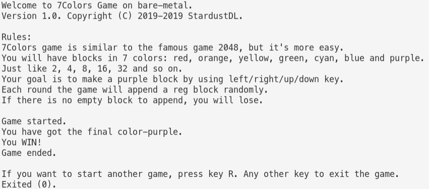
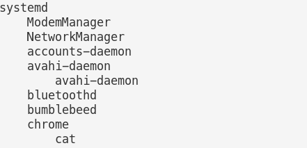
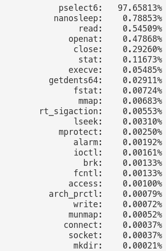
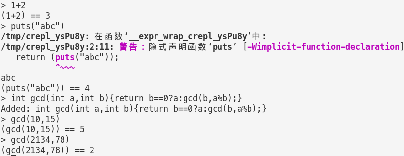
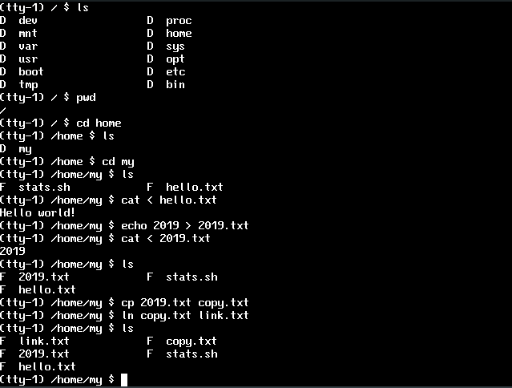
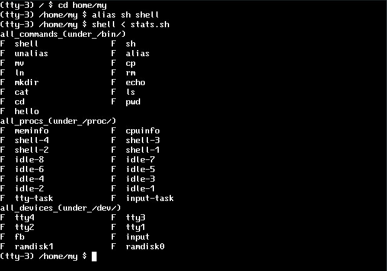

# NJU OS Lab

- Framework Codes: [NJU-ProjectN](https://github.com/NJU-ProjectN)
- Implementor: StardustDL
- Updated Time: 2019/6/14

This are the sources code of my programming assignment of OS2019 courses. It contains ALL contents from L0-L3, M1-M6.

## Labs

### amgame

A 2048-like game on abstract machine.

### pstree

A command tool that prints tree-like parent-child relationship between processes.

### libco

A lib for lightweight user-mode coroutine.

### sperf

A command tool that counts the time spent on each system call the process executes, and compares the relative proportions of these system calls.

### crepl

An interactive shell for C programming language.

### frecov

A command tool that recovers the full image file in BMP format from a given FAT32 file system image.

### libkvdb

A lib for persistent, crash-consistent key-value file-based database API.

## Kernal

A multi-core kernal that supports:
- memory management
- task (thread)
- virtual and real file system
- shell in kernal

